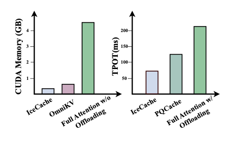

# IceCache: Memory-Efficient KV-cache Management for Long-Sequence LLMs

[](https://github.com/yuzhenmao/IceCache/blob/main/LICENSE)

### [Project](https://yuzhenmao.github.io/IceCache/) | [Paper](https://arxiv.org/abs/2604.10539)

[](https://colab.research.google.com/github/yuzhenmao/IceCache/blob/main/demo_colab.ipynb)

> **You are on the `bf16` branch.** This branch stores the offloaded KV cache in bf16 on CPU and uses the matching bf16 build of [M-DCI](https://github.com/yuzhenmao/M-DCI/tree/bf16). Both repos must be checked out on their `bf16` branches together.

IceCache is a CPU KV cache offloading system for long-sequence inference with large language models. It uses **[Multi-level Dynamic Continuous Indexing (M-DCI)](https://github.com/yuzhenmao/M-DCI)** to efficiently retrieve the most relevant KV pages from CPU memory during autoregressive decoding, enabling long-context inference without keeping the full KV cache on GPU.



## How It Works

IceCache splits the KV cache into three regions:

- **Sink pages** — the first few tokens (always retained on GPU)
- **Window pages** — the most recent tokens (always retained on GPU)
- **Offloaded pages** — the rest, stored on CPU and retrieved by DCI-based approximate nearest neighbor search

During each decoding step, IceCache uses the query vector to search the CPU-resident DCI index and fetches the top-k most relevant KV pages back to GPU for attention computation. The DCI index is built during prefill and updated incrementally during decoding.

## Notes

- **bf16 KV cache:** This branch stores the offloaded KV cache in bf16 on CPU, requiring a CPU with bf16 support. For a float32 version that runs on CPUs without bf16 support, see the [main branch](https://github.com/yuzhenmao/IceCache/tree/main) (and the [main branch of M-DCI](https://github.com/yuzhenmao/M-DCI/tree/main)).

- **CPU threads:** The [M-DCI](https://github.com/yuzhenmao/M-DCI/tree/bf16) index runs on CPU and benefits significantly from parallelism. We strongly recommend running IceCache on a machine with **≥ 64 CPU threads** for best performance. Fewer threads will work but will increase TTFT (time-to-first-token) noticeably, as the DCI indexing during prefill is the bottleneck.

  You can check and set the number of threads available to OpenMP:
  ```bash
  # Check available cores
  nproc

  # Optionally pin the thread count
  export OMP_NUM_THREADS=64
  ```

## Repository Structure

```
IceCache/
├── IceCache/
│   ├── source/
│   │   └── icecache/          # Core library
│   │       ├── adapter/       # Model patching (Llama, Mistral, etc.)
│   │       ├── infer_state.py # Per-sequence state, DCI management
│   │       ├── kv_cache.py    # CPU/GPU KV cache pool
│   │       └── kernels.py     # Custom CUDA kernels
│   ├── benchmark/
│   │   ├── run_longbench.sh   # LongBench evaluation script
│   │   ├── longbench_pred.py  # LongBench inference
│   │   ├── passkey_pred.py    # Passkey retrieval benchmark
│   │   └── gsm8k_pred.py      # GSM8K reasoning benchmark
│   └── requirements.txt
```

The DCI nearest neighbor index used by IceCache lives in a separate repository: **[M-DCI](https://github.com/yuzhenmao/M-DCI)**. For this branch, use the [`bf16` branch of M-DCI](https://github.com/yuzhenmao/M-DCI/tree/bf16).

## Installation

**Requirements:** CUDA-capable GPU, GCC, OpenBLAS

### 1. Clone

```bash
git clone -b bf16 https://github.com/yuzhenmao/IceCache.git
cd IceCache
```

### 2. Install PyTorch

```bash
pip install torch==2.4.0 torchvision==0.19.0 torchaudio==2.4.0 \
    --index-url https://download.pytorch.org/whl/cu118
```

### 3. Install dependencies

```bash
cd IceCache
pip install -r requirements.txt
pip install flash_attn==2.6.1 --no-build-isolation
```

### 4. Install the IceCache Python package

```bash
cd source
pip install -e . --no-build-isolation
```

### 5. Build and install M-DCI (the DCI index)

M-DCI is maintained in its own repository. On this branch, use its `bf16` branch. Clone it and install it into the same Python environment:

```bash
git clone -b bf16 https://github.com/yuzhenmao/M-DCI.git
cd M-DCI
python3 setup.py install
```

See the [M-DCI README](https://github.com/yuzhenmao/M-DCI/tree/bf16) for build prerequisites (OpenBLAS / Apple Accelerate, OpenMP) and troubleshooting.

## Running Benchmarks

All benchmark scripts are in `IceCache/benchmark/`.

### LongBench

```bash
cd IceCache/benchmark
bash run_longbench.sh
```

Or run a single dataset:

```bash
python longbench_pred.py \
    --icecache \
    --datasets narrativeqa \
    --page-budgets 16 \
    --page-size 16 \
    --n-win-pages 2 \
    --n-sink-pages 2 \
    --model llama-3.1 \
    --name my_run
```

### Passkey Retrieval

```bash
python passkey_pred.py \
    --icecache \
    --page-budgets 16 \
    --page-size 16 \
    --n-win-pages 2 \
    --n-sink-pages 2 \
    --model llama-3.1
```

### GSM8K

```bash
python gsm8k_pred.py \
    --icecache \
    --page-budgets 16 \
    --page-size 16 \
    --n-win-pages 2 \
    --n-sink-pages 2 \
    --model mistral-7b-inst
```

## Key Parameters

| Parameter | Description |
|---|---|
| `--page-budgets` | Number of KV pages kept on GPU per layer |
| `--page-size` | Number of tokens per page |
| `--n-sink-pages` | Pages always kept (first tokens) |
| `--n-win-pages` | Pages always kept (most recent tokens) |
| `--model` | Model alias (e.g. `llama-3.1`, `mistral-7b-inst`) |
| `--n_reuse_layers` | Reuse DCI index across N consecutive layers (IceCache-reuse) |

## Acknowledgements

This codebase builds upon [ArkVale](https://github.com/pku-liang/ArkVale). We thank the authors for their excellent work.

## Citation

```bibtex
@inproceedings{
mao2024iceformer,
title={IceFormer: Accelerated Inference with Long-Sequence Transformers on {CPU}s},
author={Yuzhen Mao and Martin Ester and Ke Li},
booktitle={The Twelfth International Conference on Learning Representations},
year={2024},
url={https://openreview.net/forum?id=6RR3wU4mSZ}
}
```

```bibtex
@inproceedings{
mao2026icecache,
title={IceCache: Memory-Efficient {KV}-cache Management for Long-Sequence {LLM}s},
author={Yuzhen Mao and Qitong Wang and Martin Ester and Ke Li},
booktitle={The Fourteenth International Conference on Learning Representations},
year={2026},
url={https://openreview.net/forum?id=yHxSKM9kdr}
}
```
